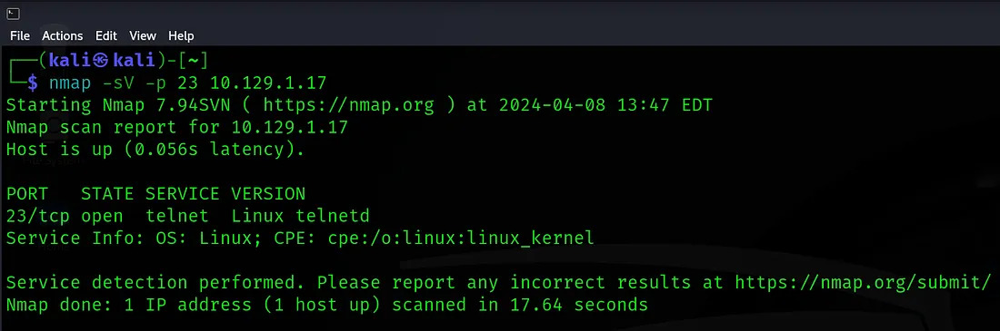

# HackTheBox Walkthrough — Meow (Starting Point)

*Meow* is one of the beginner-friendly machines from Hack The Box’s Starting Point track. It introduces new learners to the basics of enumeration and remote access by showcasing a classic security flaw: weak or missing authentication.

Below is a complete walkthrough with explanations for each task.

---

## Task 1  
**Question:** What does the acronym VM stand for?  
**Answer:** Virtual Machine  

A VM is a software-based computer system that acts like a physical one. HTB machines run in such controlled environments.

---

## Task 2  
**Question:** What tool do we use to interact with the OS using commands (console or shell)?  
**Answer:** Terminal  

This is your command-driven gateway into the system.

---

## Task 3  
**Question:** What service do we use to form our VPN connection to HTB labs?  
**Answer:** OpenVPN  

Used to securely connect to the HackTheBox private environment.

---

## Task 4  
**Question:** What tool do we use to test connectivity with ICMP echo requests?  
**Answer:** ping  

Confirm that the target is reachable.

## Task 5  
**Question:** What is the most common tool for finding open ports on a target?  
**Answer:** `nmap`

Nmap is widely used for network exploration and enumeration. It helps identify open ports, services, and potential attack surfaces.

---

## Task 6  
**Question:** What service is running on port 23/tcp?  
**Answer:** `Telnet`

Perform a version scan to confirm:

The result shows port 23/tcp running Telnet, an outdated, unencrypted remote access protocol.
## Task 7  
**Question:** Which username can log into the machine over Telnet with a blank password?  
**Answer:** `root`

Connect to the target using Telnet: `telenet <ip>`

## Task 8  
**Question:** Submit the root flag

After logging into the machine, list the files in the current directory:
`ls`

You will see a file named flag.txt. Display its contents using:

cat flag.txt

Final Thoughts

The Meow machine is a simple but valuable reminder of how insecure default configurations can expose an entire system. With open Telnet access and no password on the root account, the box highlights the importance of basic security hygiene. Completing this challenge builds confidence in enumeration, remote access, and identifying weak authentication setups.
